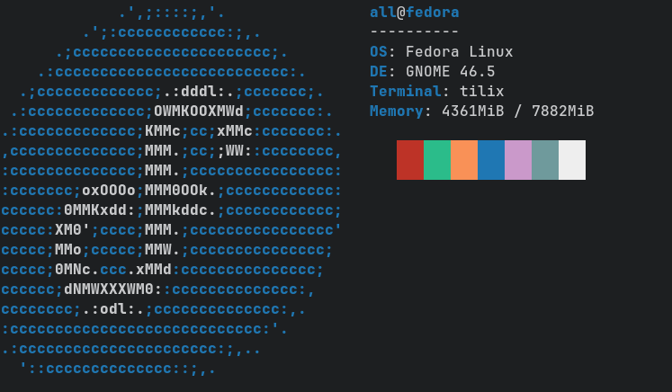

<h3 align="center">
	AllTheme for <a href="https://gnunn1.github.io/tilix-web/">Tilix</a>
</h3>

	
	
	

	

## Usage

1. Clone this repository locally.
2. Move/copy the theme files in [`themes/`](./themes/) to `~/.config/tilix/schemes`.
3. Open Tilix and select your Tilix profile in Preferences.
4. Click the "Colors" tab and select your theme of choice from the dropdown.
